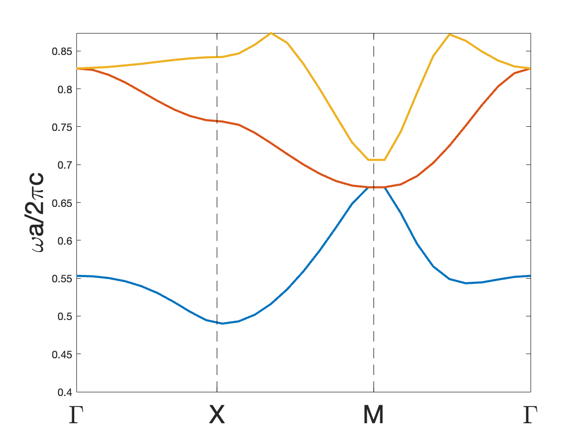
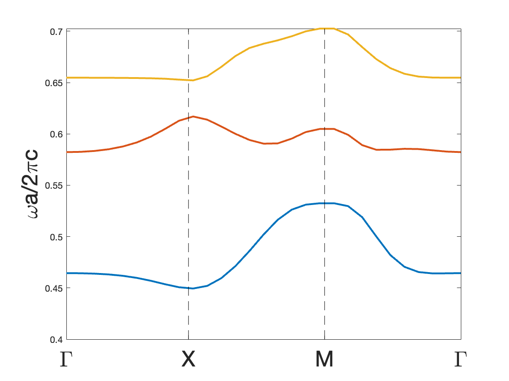
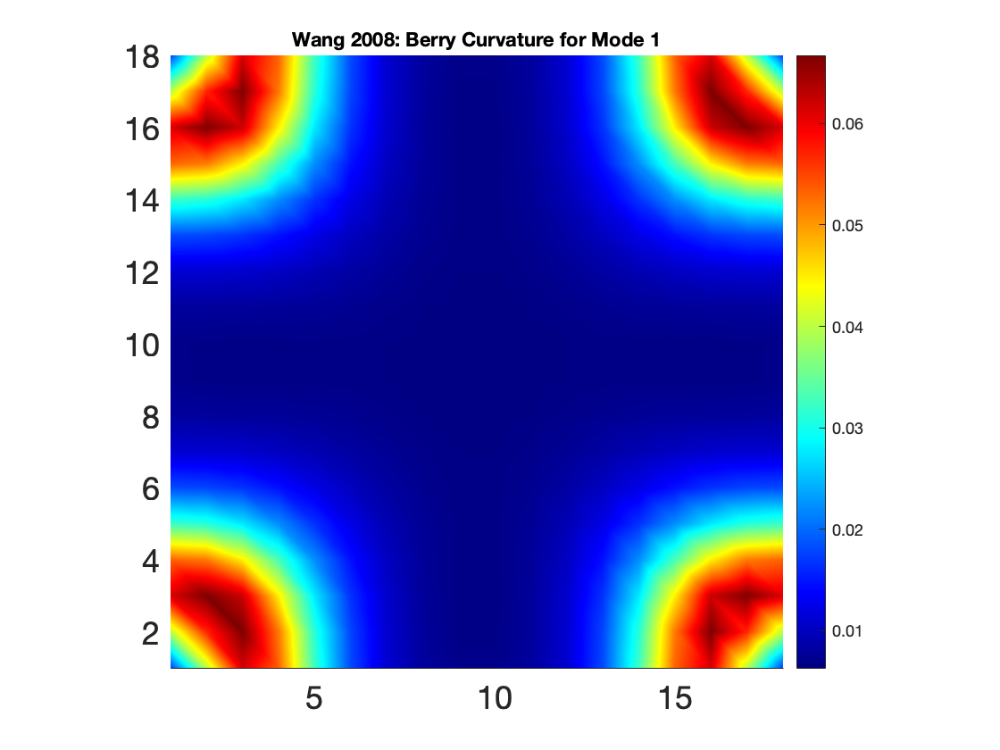
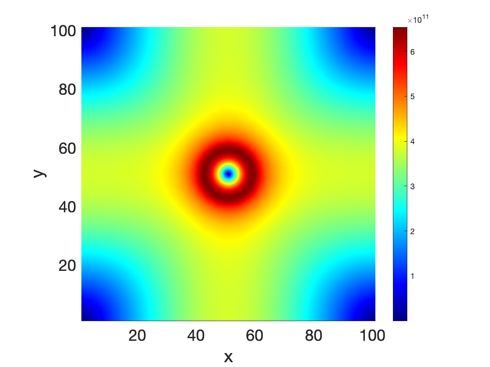
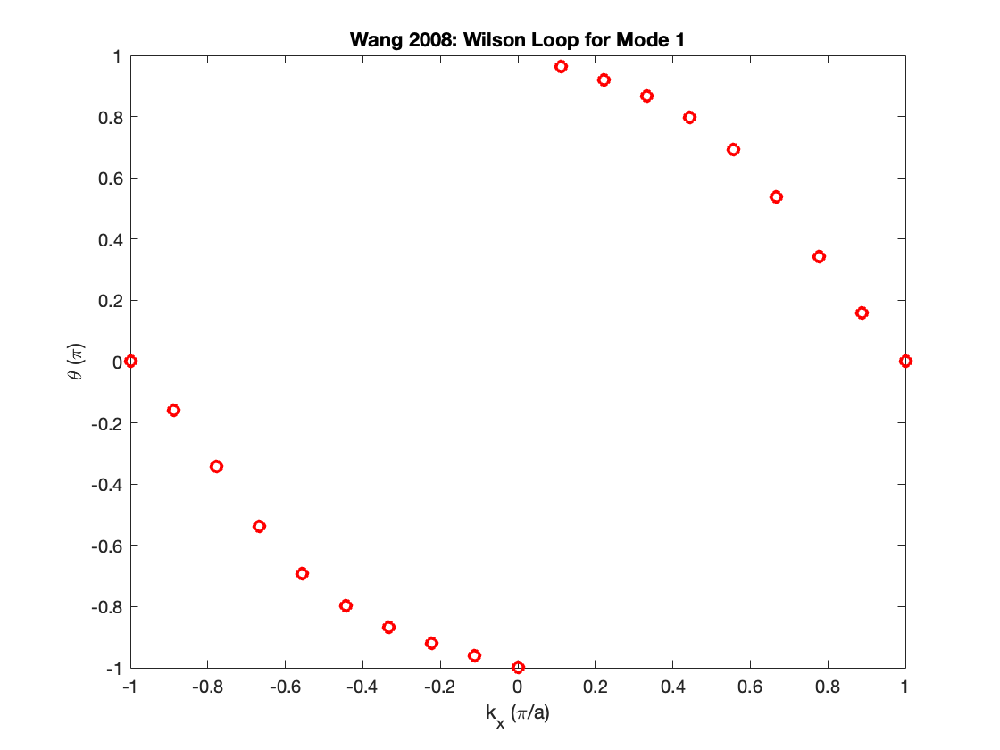

# Wang 2008 Chern PTI

This example uses a model based on Wang et al's 2008 paper "Reflection-Free One-Way Edge Modes in a Gyromagnetic Photonic Crystal" (https://link.aps.org/doi/10.1103/PhysRevLett.100.013905). It is HFSS unit cell model ("Wang2008_ChernPTI.aedt") composed of a circular rod of YIG set in a square lattice filled with vacuum. A quasi-2D approximation is made by imposing Perfect Magnetic boundary conditions on the top and bottom surfaces. Two different cases are modeled: a trivial case, with no magnetic field applied, and a nontrivial case, where the effect of the $H$ field is modeled by assuming a tensor-valued permitivity with imaginary values on the off-diagonal terms. Details on the physics can be found from the source paper.

## Band Structure Calculations
### Trivial Model
The trivial model has the band structure below. Note that the $\Gamma$ point has been copied so that the two points repeat. We can see a 2-fold degeneracy at the $M$ point. Since there is no bandgap, the Berry curvature is not computed for this case.


The diagram was made by first simulating the desired points along the BZ boundary via running an optometrics file, then extracting the data to plot. To replicate the above, follow the steps below:
1. Open the HFSS file (tested on versions 2017 - 2021 R1).
2. Run the Optometric variation "Band Structure". This will run 30 simulations, each of which are very fast.
3. Run the data extractor script ```GenerateDispersionData.py``` using the script arguments ```wangTriv,0,px,py,3,1```. The script must be located in the same directory as the .aedt file, and the model must be simulated first. The first argument can be changed to any desired name (without spaces). The second specifies a square lattice. The third and forth specifies the variable names used for the $k_x$ and $k_y$ phase boundaries. The fifth gives the desired number of modes to extract. The final specifies the Solution Setup to use. Consult the Python file for modification notes.
4. Using the resulting output .csv file ```wangTrivDispersionData.csv```, run the MATLAB formatting script ```MakeDispersionDiagram.m``` with the settings below.
	```
	cellPeriod = 20*10^-3;
	filename = 'wangNonTrivDispersionData.csv';
	modes = 3;
	lattice = 'square'; 
	scale = 'norm';
	```

If desired, copy the first row of the ```.csv``` to the last row, then re-run the MATLAB script. This is done to duplicate $\Gamma$, which makes the vertical lines match better, though is unneeded beyond visuals. 
### Nontrivial Model
The nontrivial model has the band structure below. Not that bandgaps have formed between the second and third bands. 


The above can be generated with the same steps as the trivial structure, but using the nontrivial model. 

## Topological Analysis
The information contained in the bandstructure is insufficient to fully classify the behavior of the system. The next step is to compute the topological behavior, which for this model involves the Berry curvature and Chern number.

The Berry curvature for the first band of the nontrivial model is shown below.


Note that the average value is greater than one, implying a nontrivial value when integrated. If we sum the entire surface above, we get 1.0000, which is the Chern number of this band. The value is quantized, as expected.

To compute Berry curvature (and then the Chern number):
1. Open the HFSS file (tested on versions 2017 - 2021 R1).
2. Run the Optometric variation "Full BZ". This will launch a large optometric problem with 361 simulations total. Running distributed with multiple cores/nodes is recommended, but not strictly needed.
4. Run the data extractor script ```SaveEigenFields.py``` using the script arguments ```wangNonTriv_,grid,E,1```. The script must be located in the same directory as the .aedt file, and the model must be simulated first. Further, the file ```grid.pts``` must also be in the same directory. The first argument can be changed to any desired name (without spaces). The second specifies the points grid (points in real space), an example for which is provided in ```grid.pts```. The third argument specifies the field to extract (E for electric or H for magnetic), and the last argument specifies the Solution Setup to use. It will take upwards of 40 minutes to extract all 361 fields on a standard 12 core Xeon processor. The script will output information as it saves the data, which can be used to debug issues. Note that the field that is extracted is the one that is currently enabled on the Edit Sources... option in HFSS. The script will output 6 files total: 4 are pieces of the field data (broken into pieces to avoid size limitations of HFSS's implementation of Python), a file of the spatial epsilon data (```epsi.fld```), and a file of the spatial mu data (```mu.fld```). 
6. Combine the four field data files (```wangNonTriv_1.csv, wangNonTriv_2.csv, wangNonTriv_3.csv, wangNonTriv_4.csv```) into a single file by running the MATLAB script ```CombineData.m```. A modified version of it is included in this example, with the correct settings used. The output will be one file named ```wangNonTriv1_full.csv```. The ```_full``` is appended to avoid accidentally overwriting (this script can take a long time if used on large grids/files). 
7. Rename the output file to ```wangNonTrivFull1.csv```. This is to make the processing easier, and to avoid overwriting files. 
8. Compute the Berry curvature by running the MATLAB script ```analyzeData.m```. This is a one-off script that uses ```ComputeBerryCurvature()``` to do the calculation in a less manual fashion. By default the script will output (1) a typical plot of the modal field, (2) the Berry curvature of the first band, and (3) the Wilson loop eigenspectra, and will print out the Chern number to the console. 

The expected mode profile is shown below (helpful for debugging):

The last plot is the Wilson loop spectra:


The Chern number can be computed by integration (summing in this case) the Berry curvature, or by counting the number of times the Wilson loop covers the entire BZ. 